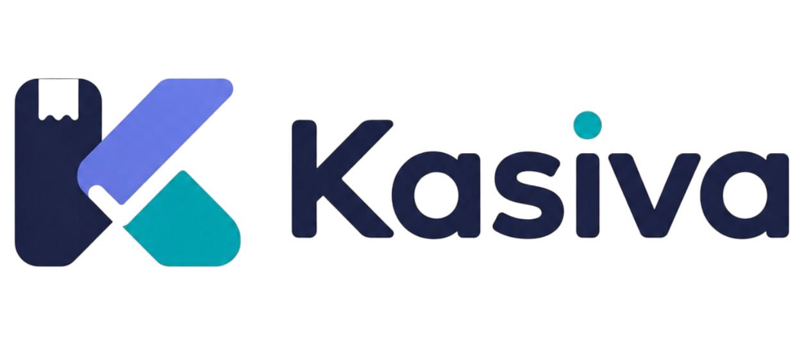

# Kasiva POS — Sistem POS SaaS Modern Multi-Platform

<p align="center">
  
</p>

<p align="center">
  
  
  
  
  
</p>

---

## 🌟 Tentang Kasiva POS

**Kasiva POS** adalah sistem kasir pintar (*Point of Sale*) modern berbasis SaaS yang dirancang khusus untuk bisnis F&B (Kafe, Resto, Coffee Shop) dan Retail di Indonesia. Dilengkapi dengan kalkulasi HPP otomatis per transaksi, integrasi platform delivery online, manajemen resep bahan baku, analitik profitabilitas 4-tier, dan keamanan hak akses bertingkat (*Role-Based Access Control*).

---

## 🚀 Fitur Unggulan

### 1. 💳 Kasir & Transaksi Cepat
- **Kalkulasi HPP & Margin Otomatis**: Menghitung modal dan keuntungan bersih langsung pada setiap item transaksi.
- **Kanal Penjualan Fleksibel**: Dine-in, Takeaway, dan Platform Online Delivery (GoFood, GrabFood, ShopeeFood).
- **Penyesuaian Nominal Bersih Online**: Mendukung input nominal pembayaran bersih yang diterima outlet setelah potongan komisi marketplace.
- **Split Bill & Pembulatan Kembalian**: Fitur pisah bayar meja serta pembulatan nominal ke kelipatan Rp 100 / Rp 500 / Rp 1.000.
- **Struk Thermal Digital (Format KSV)**: Kompatibel dengan printer thermal Bluetooth/USB ESC/POS 58mm & 80mm.

### 2. 📦 Inventaris & Manajemen Resep Bahan Baku
- **Katalog Produk & Varian**: Manajemen kategori, SKU, barcode scanner, gambar produk, dan opsi varian harga.
- **Pemotongan Stok Bahan Otomatis (Recipe BOM)**: Setiap menu terjual otomatis memotong gramatur bahan baku di database via transaksi atomik `DB::transaction()`.
- **Restok & Peringatan Stok Kritis**: Monitor batas minimum stok bahan baku dengan alert visual.

### 3. 🎯 Pemasaran & Loyalitas Pelanggan (CRM)
- **Member & QR Card**: Pendaftaran pelanggan, riwayat transaksi, dan cetak QR Member.
- **Program Loyalitas**: Konfigurasi poin belanja per transaksi dan tukar reward.
- **Diskon & Voucher Promosi**: Diskon persentase, nominal tetap, minimal belanja, dan batas waktu aktif.
- **Paket Bundle Menu**: Bundling menu hemat untuk meningkatkan *Average Order Value* (AOV).
- **Kampanye Siaran (Broadcast Campaign)**: Template pesan promosi WhatsApp / SMS pelanggan.

### 4. 📊 Laporan Finansial & AI Health Insights
- **Analitik Margin 4-Tier**: Klasifikasi kesehatan profit (*Critical <20%*, *Warning 20-35%*, *Healthy 35-50%*, *Elite >50%*).
- **Laba Rugi & Arus Kas**: Laporan omset kotor, potongan diskon, HPP bahan, biaya operasional, dan laba bersih.
- **Proyeksi Omset Cerdas**: Perhitungan tren penjualan dan estimasi pendapatan harian/bulanan.
- **Ekspor Laporan**: Dukungan ekspor laporan keuangan dan struk transaksi.

### 5. 🛡️ Keamanan RBAC (Role-Based Access Control)
- **Proteksi Lapis Ganda (*Defense-in-Depth*)**:
  - **HTTP Kernel Middleware** (`App\Http\Middleware\RequirePermission`): Memblokir rute di tingkat kernel HTTP sebelum komponen/controller diinisialisasi.
  - **Livewire Authorization**: Pengecekan izin di method `mount()`.
- **Matriks Peran Default**:
  - **Owner**: Akses penuh (*bypass*) ke seluruh modul sistem, pengaturan outlet, staf, dan peran.
  - **Manager**: Akses operasional harian (Kasir, Katalog, Resep Bahan, Diskon, Member, Laporan Keuangan, Pengeluaran, Printer, Pembayaran).
  - **Staf Kasir**: Dibatasi ketat hanya pada operasional kasir (`/pos`) dan riwayat transaksi (`/history`). Otomatis diblokir (**403 Forbidden**) dari modul Pemasaran, Inventaris, Laporan, Pengeluaran, dan Pengaturan.

### 6. 🎨 UI/UX & Design System Premium
- **Kasiva Palette Tokens**: `#272D48` (Navy), `#505B93` (Blue-violet), `#00AAA6` (Teal), `#8696ED` (Periwinkle), `#3EDAD7` (Cyan).
- **Auto-Detect System Theme & Anti-FOUC**: Otomatis mendeteksi preferensi tema OS (*Dark / Light Mode*) dengan transisi instan tanpa layar putih berkedip.
- **High-Contrast Toggle Switches**: Indikator status aktif/nonaktif yang jelas dan kontras tinggi di kedua tema.
- **Halaman Error Kustom**: Tampilan ramah pengguna untuk kode status `400`, `401`, `403`, `404`, `419`, `429`, `500`, `502`, `503`.

---

## 🔑 Kredensial Pengujian Default

Setelah menjalankan seeder (`php artisan db:seed`), akun-akun default berikut siap digunakan:

| Peran Akun | Email | Kata Sandi | Cakupan Akses |
| :--- | :--- | :--- | :--- |
| **Owner (Maya Pratama)** | `owner@kasiva.pos` | `password123` | Akses penuh ke seluruh fitur & pengaturan |
| **Manager (Budi Santoso)** | `manager@kasiva.pos` | `password123` | Operasional, laporan, bahan baku, promosi |
| **Staf Kasir (Rizki Kasir)** | `kasir@kasiva.pos` | `password123` | Terbatas hanya Kasir POS & Riwayat Transaksi |

---

## ⚙️ Persyaratan Sistem & Instalasi

### Kebutuhan:
- PHP >= 8.2 (dengan ekstensi `pdo_sqlite` / `pdo_mysql`, `mbstring`, `openssl`, `curl`)
- Composer >= 2.x
- Node.js >= 18.x & NPM

### Langkah Instalasi:

```bash
# 1. Clone repositori & masuk ke direktori
cd kasiva

# 2. Install dependensi PHP & JavaScript
composer install
npm install

# 3. Salin file konfigurasi lingkungan
cp .env.example .env

# 4. Generate application key
php artisan key:generate

# 5. Jalankan migrasi database & seeding data produksi
php artisan migrate:fresh --seed

# 6. Build aset frontend (Tailwind CSS v4 & Vite)
npm run build

# 7. Jalankan server pengembangan lokal
php artisan serve
```

Aplikasi dapat diakses di browser melalui: `http://localhost:8000`

---

## 🧪 Pengujian & Verifikasi Kualitas (Testing)

### 1. Backend Feature & Unit Tests (Pest / PHPUnit)
```bash
php artisan test
```
*Hasil saat ini: **27/27 Tests Passed (166 Assertions)**.*

### 2. End-to-End Browser Tests (Playwright)
```bash
# Menjalankan seluruh pengujian E2E (Desktop & Mobile Chrome)
npx playwright test --config=tests/e2e/playwright.config.ts

# Menjalankan suite pengujian spesifik
npx playwright test tests/e2e/rbac-and-toggle-proof.spec.ts --config=tests/e2e/playwright.config.ts
npx playwright test tests/e2e/error-pages.spec.ts --config=tests/e2e/playwright.config.ts
```
*Hasil saat ini: **28/28 E2E Scenarios Passed (100%)**.*

---

## 📁 Struktur Direktori Utama

```
kasiva/
├── app/
│   ├── Http/Middleware/RequirePermission.php   # HTTP Kernel RBAC Middleware
│   ├── Livewire/
│   │   ├── Pos/CashierScreen.php               # Modul Kasir Utama
│   │   ├── Inventory/                          # Katalog, Bahan Baku, Kategori
│   │   ├── Marketing/                          # Member, Promo, Bundle, Diskon
│   │   ├── Reports/FinancialReports.php        # Laporan & Proyeksi Margin
│   │   ├── Expenses/ExpenseManager.php         # Biaya Pengeluaran Outlet
│   │   └── Settings/                           # Pengaturan Outlet, Staf, Peran
│   └── Models/                                 # Eloquent Models & RBAC Relations
├── database/
│   ├── migrations/                             # Skema Database UUID
│   └── seeders/KasivaProductionSeeder.php      # Seeder Data Produksi
├── resources/
│   ├── css/app.css                             # Token Desain & Theme Engine
│   └── views/
│       ├── errors/                             # Halaman Error 400-503
│       ├── layouts/app.blade.php               # Master Layout POS & RBAC Nav
│       └── livewire/                           # Template Blade Livewire
└── tests/
    ├── Feature/                                # Backend Security & Business Tests
    └── e2e/                                    # Playwright E2E Test Suites
```

---

## 📄 Lisensi

Kasiva POS dilisensikan di bawah [MIT License](LICENSE).
