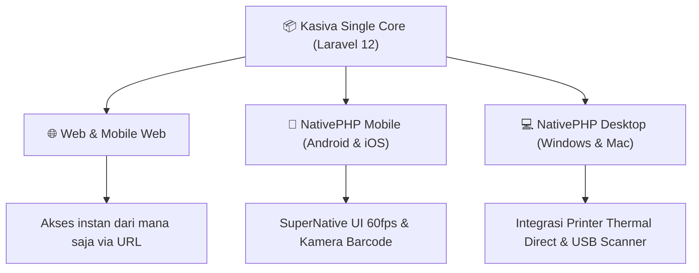

# Dokumen Visi & Strategi Produk: Kasiva POS

## 1. Visi Produk

**Kasiva** adalah sistem Point of Sale (POS) SaaS Modern Multi-Platform yang dirancang khusus untuk Usaha Mikro, Kecil, dan Menengah (UMKM) serta bisnis F&B / Retail di Indonesia. 

Kasiva mengusung filosofi **"Single Codebase, Omnichannel Multi-Target Execution"** di mana satu sistem inti (Laravel 12 + Livewire 4 + TailwindCSS v4 + NativePHP) dapat beroperasi secara seamless di:
1. **Web Browser (Desktop)**
2. **Mobile Web (HP/Tablet Browser)**
3. **Android App (NativePHP Mobile / APK)**
4. **iOS App (NativePHP Mobile / IPA)**
5. **Desktop App (NativePHP Desktop / Windows .exe & Mac .dmg)**

---

## 2. Masalah Utama & Value Proposition

| Masalah Utama POS Tradisional / Web POS | Solusi Kasiva POS | Value Proposition Kasiva |
|---|---|---|
| Ketergantungan penuh pada koneksi internet (kasir macet saat internet mati) | **True Offline-First dengan Engine SQLite Lokal** | Kasir tetap dapat bertransaksi 100% tanpa internet; data otomatis tersinkron saat online. |
| Cetak struk fisik di browser rumit & butuh dialog cetak manual | **Direct Native Hardware Bridge** (ESC/POS Printer & Cash Drawer) | Cetak struk instan ke Bluetooth/USB Printer & membuka laci kasir otomatis. |
| PWA/IndexedDB rentan terhapus oleh cache browser | **Permanent On-Device SQLite Storage** | Data transaksi disimpan di SQLite lokal aplikasi native yang aman dan tidak terhapus cache. |
| Tampilan kaku, tidak cocok di layar HP/Tablet kasir | **Dynamic Adaptive Design (TailwindCSS v4)** | Interface menyesuaikan otomatis dari Bottom Sheet di HP menjadi Sidebar di Desktop. |

---

## 3. Strategi Platform & Teknologi

---

## 4. Indikator Keberhasilan Produk (Key Performance Indicators)

1. **Transaction Velocity**: Transaksi checkout kasir dapat diselesaikan dalam waktu **< 3 detik** per transaksi.
2. **Offline Reliability**: **100% data transaksi** tercatat dan tersimpan tanpa data loss meski perangkat kehilangan koneksi selama berhari-hari.
3. **Sync Integrity**: **0% konflik data** saat antrean transaksi offline dikirim ke server Cloud melalui mekanisme idempotent sync.
4. **User Satisfaction (CSAT)**: Skor kemudahan penggunaan oleh kasir minimal **4.8 / 5.0**.
