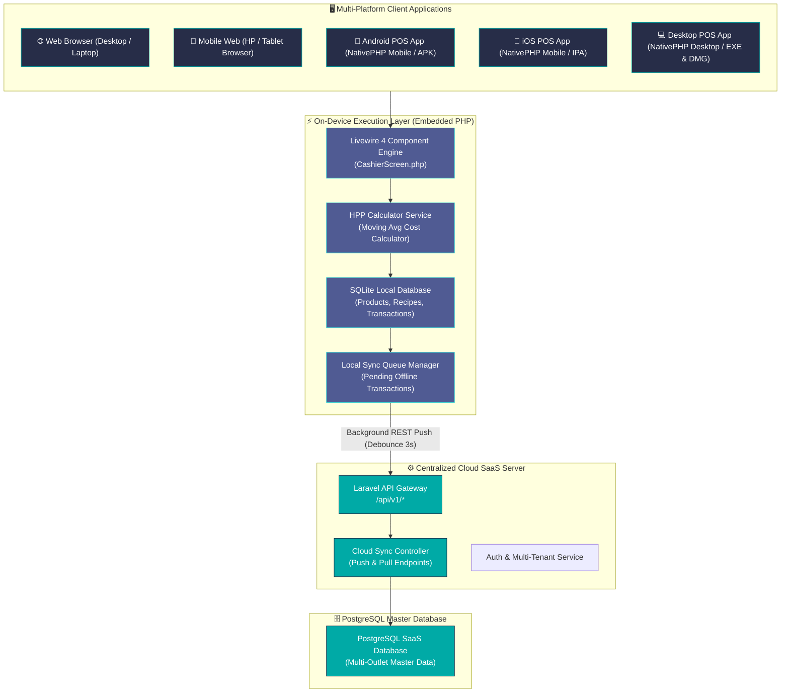
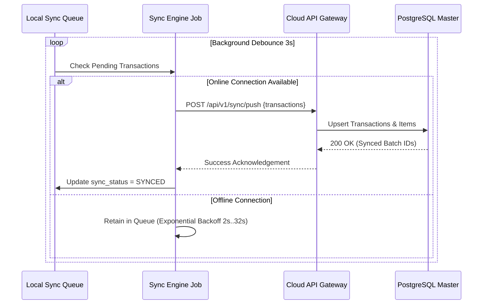

# High-Level Design (HLD)

## Kasiva — Arsitektur Sistem POS Multi-Platform

| Metadata | Detail |
|---|---|
| **Model Arsitektur** | Hybrid Offline-First Single Codebase (Laravel 13 Core + NativePHP Bridge) |
| **Frontend UI** | Livewire 4 + Blade + TailwindCSS v4 (@theme CSS Engine) |
| **Backend Engine** | Laravel 13 (PHP 8.3+) |
| **Local Client DB** | On-Device SQLite (`database.sqlite`) |
| **Cloud Server DB** | Centralized PostgreSQL (SaaS Master DB) |

---

## 1. Diagram Arsitektur Sistem Komprehensif



---

## 2. Diagram Aliran Data End-to-End (Data Flow)

### 2.1 Aliran Checkout Kasir & Pemotongan Stok (Atomic Local Flow)

```mermaid
sequenceDiagram
    participant K as Kasir (UI)
    participant LW as Livewire CashierScreen
    participant HS as HppCalculatorService
    participant DB as Local SQLite DB
    participant SQ as Sync Queue

    K->>LW: addToCart(product_id)
    LW->>LW: Hitung Subtotal & Estimasi HPP
    K->>LW: openCheckoutModal()
    K->>LW: Input Paid Amount & Select Payment Method (CASH/QRIS/SPLIT)
    K->>LW: processCheckout()
    
    rect rgb(39, 45, 72)
        Note over LW,DB: Transaction Atomic Scope
        LW->>HS: deductRecipeStockForCheckout(product, qty)
        HS->>DB: Decrement Current Stock Bahan Baku (Product Recipes)
        HS->>DB: Decrement Current Stock Produk
        LW->>DB: INSERT Transaction (KSV-YYYYMMDD-XXXX)
        LW->>DB: INSERT TransactionItems
        LW->>SQ: Enqueue Transaction ID (sync_status = PENDING_SYNC)
    end

    LW-->>K: Render Modal Struk Digital Kasiva
```



### 2.1.1 Aliran Platform Adjustment (Pesanan Delivery)

Step checkout tambahan untuk pesanan dari platform delivery (GoFood/GrabFood/ShopeeFood). Kasir menerima total tagihan yang **sudah di-override** oleh platform (mis. ada diskon promo atau biaya layanan), yang **tidak sama** dengan jumlah `cart.items.sum(subtotal)`. Selisihnya dicatat agar laporan profit tetap akurat.

```
Kasir                CashierScreen          CheckoutService        DB (transactions)
  |                       |                       |                       |
  |-- pilih step 3 ------->|                       |                       |
  |  (PLATFORM_ADJUSTMENT) |                       |                       |
  |<-- modal setoran -----|                       |                       |
  |  tampilkan:           |                       |                       |
  |   - total cart items  |                       |                       |
  |   - total tagihan     |                       |                       |
  |   - selisih           |                       |                       |
  |                       |                       |                       |
  |-- input adjusted      |                       |                       |
  |  amount + platform    |                       |                       |
  |  (GoFood/GrabFood/dll)|                       |                       |
  |                       |                       |                       |
  |-- klik Konfirmasi --->|                       |                       |
  |                       |-- validate step ------>|                       |
  |                       |   (PLATFORM_ADJUSTER)  |                       |
  |                       |                       |                       |
  |                       |<-- hitung selisih ----|                       |
  |                       |   $diff = total -     |                       |
  |                       |   adjusted            |                       |
  |                       |   if $diff >= 0:      |                       |
  |                       |     platform_disc = $diff
  |                       |   else:               |                       |
  |                       |     platform_markup = |                       |
  |                       |       abs($diff)      |                       |
  |                       |                       |                       |
  |                       |-- DB::transaction ---->|                       |
  |                       |   INSERT transactions |---- INSERT ----------->|
  |                       |   (platform_discount, |   platform_discount,   |
  |                       |    platform_markup,   |   platform_markup,     |
  |                       |    is_backdated)      |   is_backdated)        |
  |                       |                       |                       |
  |<-- render struk KSV --|                       |                       |
```

**Field database** (migration `2026_08_12_000002_create_extended_kasiva_tables.php`):
- `transactions.platform_discount` DECIMAL(12,2) DEFAULT 0 — selisih positif (tagihan lebih kecil dari cart items)
- `transactions.platform_markup` DECIMAL(12,2) DEFAULT 0 — selisih negatif (tagihan lebih besar dari cart items)
- `transactions.is_backdated` BOOLEAN DEFAULT false — flag terpisah untuk transaksi backdate, di-aggregate terpisah di FinancialReports

**Laporan** (`FinancialReports::render()`): aggregate `Σ(total_amount - itemsSum)` per-periode dikalikan `is_backdated` atau `platform_discount != 0` flag, ditampilkan sebagai `Penyesuaian Platform` dengan warna emerald untuk positif (adjustment naik, kasir selisih) atau rose untuk negatif.

**Mengapa ini tidak cukup hanya dengan diskon biasa?**
- `campaign_discount` dihitung dari harga sebelum transaksi dan **mengurangi** HPP/snapshot profit dari item cart. `platform_discount` adalah **delta terhadap total tagihan** yang **tidak** mengubah HPP item — jadi profit per-item tetap akurat, hanya total revenue yang disesuaikan.
- Laba bersih per-item tidak terkontaminasi oleh override kasir. Laporan profit per-item tetap merefleksikan resep + harga jual sebenarnya.

### 2.2 Aliran Sinkronisasi Latar Belakang (Offline-First Sync Flow)



---

## 3. Strategi Deployment Multi-Platform (Single Codebase)

1. **Web & Mobile Web**: Di-deploy ke Cloud Server (Render / Vercel / Forge). Layout otomatis responsif di HP/Tablet dengan TailwindCSS v4.
2. **Android & iOS App**: Di-build menggunakan **NativePHP Mobile SuperNative** yang mengubah komponen Blade menjadi antarmuka native.
3. **Desktop App**: Di-build menggunakan **NativePHP Desktop** yang meng-embed PHP 8.3+ & SQLite ke dalam installer desktop `.exe` (Windows) dan `.dmg` (macOS).
