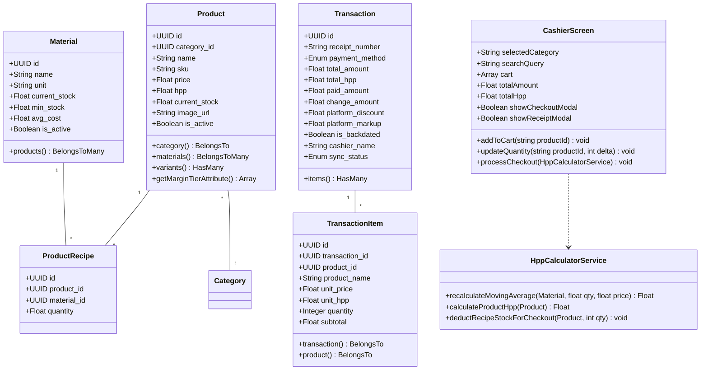

# Low-Level Design (LLD)

## Kasiva — Spesifikasi Detail Komponen & Class Architecture

| Metadata | Detail |
|---|---|
| **Namespace Utama** | `App\` |
| **Framework Base** | Laravel 13 |
| **Component System** | Livewire 4 Components & Blade Views |

---

## 1. Class Diagram & Komponen Core



---

## 2. Detail Kontrak Interface Services

### 2.1 `HppCalculatorService` (`app/Services/HppCalculatorService.php`)

```php
namespace App\Services;

use App\Models\Material;
use App\Models\Product;

class HppCalculatorService
{
    /**
     * Recalculates moving average cost of a raw material upon restocking.
     * Formula: ((currentStock * currentAvgCost) + (incomingQty * incomingPrice)) / (currentStock + incomingQty)
     */
    public function recalculateMovingAverage(Material $material, float $incomingQty, float $incomingPrice): float;

    /**
     * Calculates the total COGS (HPP) for a product based on its ingredient recipes.
     */
    public function calculateProductHpp(Product $product): float;

    /**
     * Deducts material stock atomically during checkout.
     */
    public function deductRecipeStockForCheckout(Product $product, int $qty): void;
}
```

---

## 3. Responsive Breakpoints & Viewport Layout Rules

| Viewport Target | CSS Breakpoint | Komponen Keranjang (Cart) | Grid Produk |
|---|---|---|---|
| **Mobile (Smartphones)** | `< 768px` (`sm:`, default) | Floating Bottom Bar / Sheet Drawer Modal | 2 Kolom Card Grid |
| **Tablet (iPads / Android Tabs)** | `768px - 1024px` (`md:`) | Fixed Right Sidebar (Width 320px) | 3 Kolom Card Grid |
| **Desktop (PC Kasir)** | `> 1024px` (`lg:`, `xl:`) | Fixed Right Sidebar (Width 384px) | 4 Kolom Card Grid |
