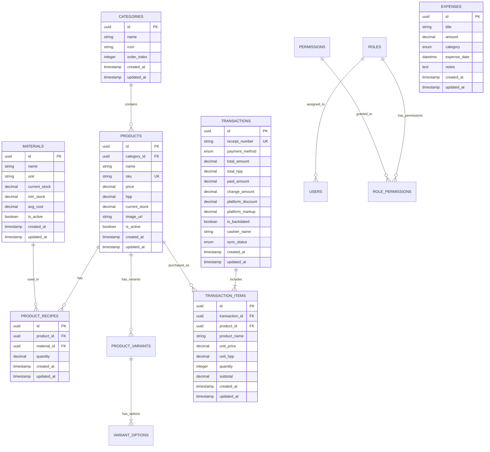

# Entity-Relationship Diagram (ERD) & Database Schemas

## Kasiva — Spesifikasi Basis Data

| Metadata | Detail |
|---|---|
| **Database Engines** | SQLite (Client On-Device) & PostgreSQL (Cloud Master) |
| **Primary Keys** | UUID v4 / UUID v7 |
| **ORM Layer** | Laravel Eloquent ORM |

---

## 1. Diagram Relasi Entitas (Mermaid ERD)

---

## 2. Kamus Data & Constraints

### 2.1 Tabel `materials` (Bahan Baku)
- `id` (UUID, Primary Key)
- `name` (VARCHAR 255, NOT NULL)
- `unit` (VARCHAR 50, NOT NULL) — e.g. `ml`, `gram`, `pcs`
- `current_stock` (DECIMAL 12,2, DEFAULT 0.00)
- `min_stock` (DECIMAL 12,2, DEFAULT 10.00)
- `avg_cost` (DECIMAL 12,2, DEFAULT 0.00) — Moving Average Unit Cost
- `is_active` (BOOLEAN, DEFAULT true)

### 2.2 Tabel `products` (Produk Kasir)
- `id` (UUID, Primary Key)
- `category_id` (UUID, Foreign Key `categories.id`, NULLABLE)
- `name` (VARCHAR 255, NOT NULL)
- `sku` (VARCHAR 100, UNIQUE, NOT NULL)
- `price` (DECIMAL 12,2, NOT NULL) — Harga Jual
- `hpp` (DECIMAL 12,2, DEFAULT 0.00) — Auto Calculated COGS
- `current_stock` (DECIMAL 12,2, DEFAULT 0.00)
- `image_url` (VARCHAR 255, NULLABLE)
- `is_active` (BOOLEAN, DEFAULT true)

### 2.3 Tabel `transactions` (Transaksi Penjualan)
- `id` (UUID, Primary Key)
- `receipt_number` (VARCHAR 100, UNIQUE, NOT NULL) — e.g. `KSV-YYYYMMDD-XXXX`
- `payment_method` (ENUM: `'CASH'`, `'QRIS'`, `'SPLIT'`, `'GOFOOD'`, `'GRABFOOD'`, `'SHOPEEFOOD'`, NOT NULL)
- `total_amount` (DECIMAL 12,2, NOT NULL)
- `total_hpp` (DECIMAL 12,2, NOT NULL)
- `paid_amount` (DECIMAL 12,2, NOT NULL)
- `change_amount` (DECIMAL 12,2, DEFAULT 0.00)
- `platform_discount` (DECIMAL 12,2, DEFAULT 0.00)
- `platform_markup` (DECIMAL 12,2, DEFAULT 0.00)
- `is_backdated` (BOOLEAN, DEFAULT false)
- `cashier_name` (VARCHAR 100, DEFAULT `'Kasir Utama'`)
- `sync_status` (ENUM: `'SYNCED'`, `'PENDING_SYNC'`, DEFAULT `'SYNCED'`)

### 2.4 Tabel `expenses` (Pengeluaran Operasional Toko)
- `id` (UUID, Primary Key)
- `title` (VARCHAR 255, NOT NULL)
- `amount` (DECIMAL 12,2, NOT NULL)
- `category` (ENUM: `'RAW_MATERIAL'`, `'RENT'`, `'SALARY'`, `'UTILITIES'`, `'MARKETING'`, `'OPERATIONAL'`, `'OTHER'`, DEFAULT `'OPERATIONAL'`)
- `expense_date` (DATETIME, NOT NULL)
- `notes` (TEXT, NULLABLE)
