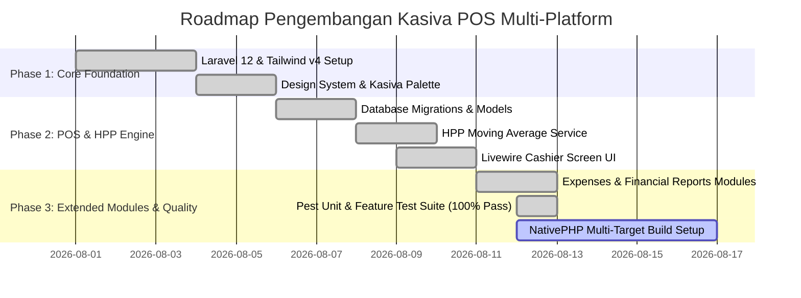

# Work Breakdown Structure (WBS) & Product Roadmap

## Kasiva — Rencana Pengembangan Produk

| Metadata | Detail |
|---|---|
| **Manajemen Proyek** | Agile Scrum / Sprint Milestones |
| **Prinsip Pengujian** | Test-Driven Development (TDD) + Pest Testing Suite |

---

## 1. Roadmap Rilis Produk (Milestone Roadmap)

---

## 2. Work Breakdown Structure (WBS Tasks)

### 📊 Task Group 1: Branding & Product Architecture
- [x] **WBS-1.1**: Penetapan Nama Produk (**Kasiva**) dan Repositori (`~/Projects/riod94/kasiva`).
- [x] **WBS-1.2**: Integrasi Token Warna Brand (Kasiva Navy `#272D48`, Teal `#00AAA6`, Blue-violet `#505B93`, Periwinkle `#8696ED`, Cyan-teal `#3EDAD7`).
- [x] **WBS-1.3**: Pemasangan Aset Logo Resmi (`kasiva-logo-full.png`, `kasiva-logo-icon.png`, `kasiva-logo-wordmark.png`).

### ⚡ Task Group 2: Business Logic & HPP Engine
- [x] **WBS-2.1**: Implementasi `HppCalculatorService` dengan formula *moving average cost* bahan baku.
- [x] **WBS-2.2**: Implementasi pemotongan stok otomatis bahan baku & produk berbasis resep porsi saat checkout.
- [x] **WBS-2.3**: Penulisan Unit Test Pest PHP untuk kalkulasi HPP & resep.

### 🛒 Task Group 3: Responsive POS Cashier & Core Modules
- [x] **WBS-3.1**: Pembuatan komponen Livewire `CashierScreen` (Pencarian produk, filter kategori, manajemen keranjang).
- [x] **WBS-3.2**: Modal Pembayaran (Tunai, QRIS, Split) dengan kalkulasi kembalian otomatis.
- [x] **WBS-3.3**: Modal Struk Digital Kasiva (`KSV-YYYYMMDD-XXXX`).
- [x] **WBS-3.4**: Modul Riwayat Transaksi (`TransactionHistory`), Pengeluaran (`ExpenseManager`), Laporan Keuangan (`FinancialReports`), Setelan (`SettingsHub`, `ProductManager`).
- [x] **WBS-3.5**: Navigasi Utama (Fixed Bottom Navigation 5 Tab di Mobile, Header Nav).

### 🧪 Task Group 4: Quality Assurance & Native Integration
- [x] **WBS-4.1**: Eksekusi Pest Test Suite (6 Tests PASS, 100% Green).
- [x] **WBS-4.2**: Pengujian Vite asset compilation (`npm run build` PASS).
- [ ] **WBS-4.3**: Instalasi & Kompilasi NativePHP (`nativephp/mobile`).
